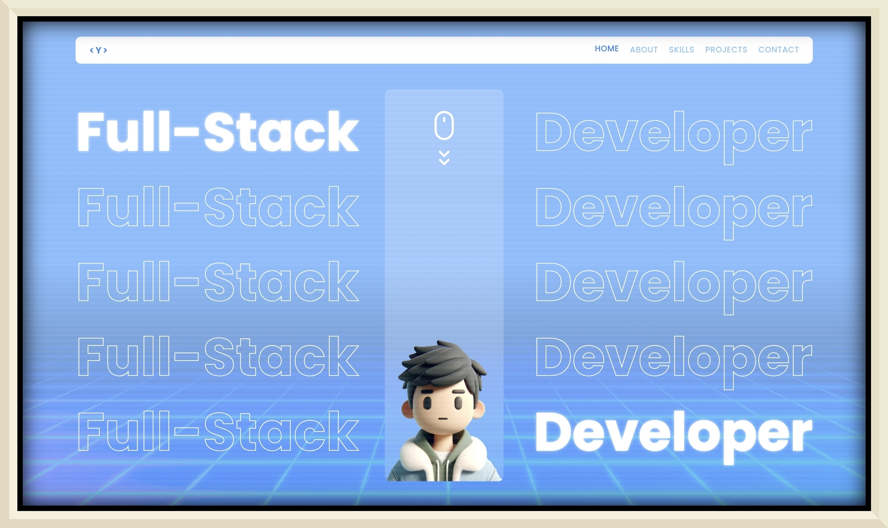
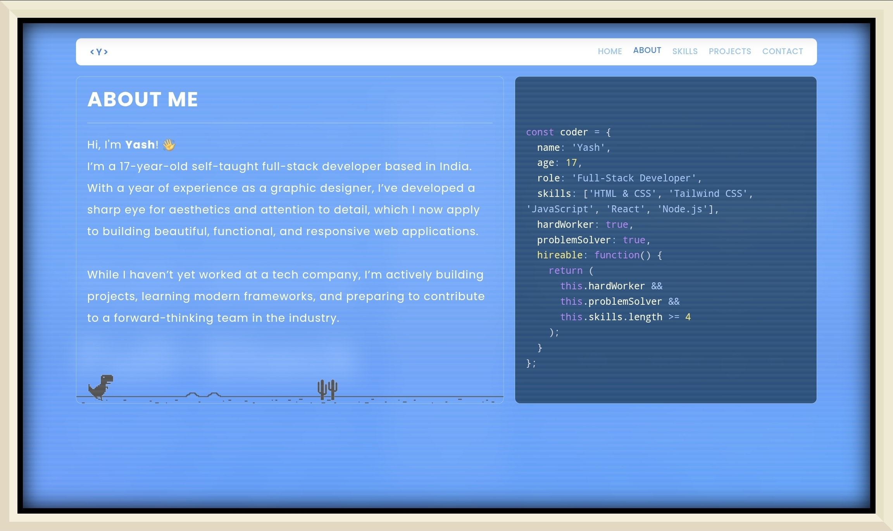
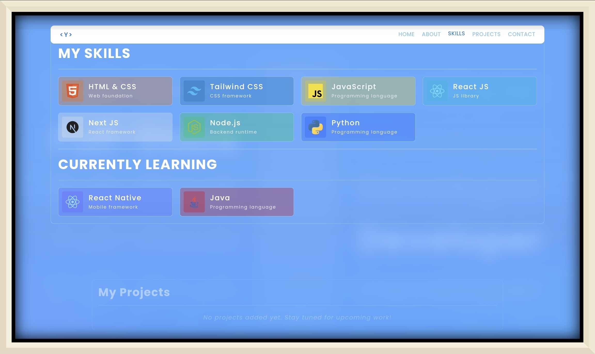
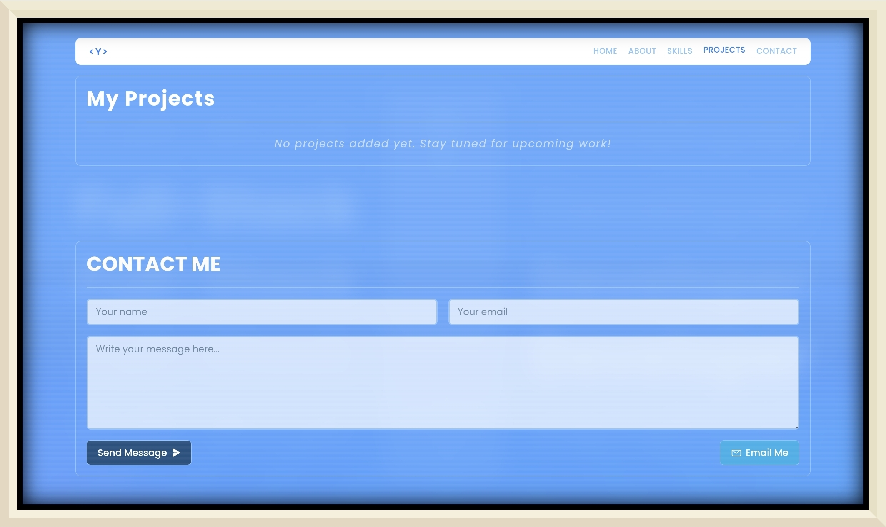

# 🧑‍💻 Yash Modi — Developer Portfolio

Welcome to my personal developer portfolio! Built with **React**, **TypeScript**, and **Tailwind CSS**, this website is a showcase of my skills, projects, and passion for front-end development — styled with a nostalgic _Windows XP/Vista aesthetic_ and modern glitch effects.

## 📸 Previews

### 🏠 Home


### 👤 About


### 🛠️ Skills


### 📁 Projects & Contact


---

## 🚀 Features

-   ⚡ **Responsive Layout** — Works seamlessly across devices
-   🪟 **Retro UI** — Windows-era theme with glitch screen effects
-   🕹️ **Self-running Dino Game** — Inspired by the Chrome Dino, with automatic jumps(Just An Animation For Now )
-   🧩 **Modular Components** — Easy to read, scalable structure
-   🧭 **Smooth Section Navigation** — Custom hook-powered anchor scrolling
-   🛠️ **Showcase of Projects, Skills, and About Me**

---

## 📁 Project Structure

```
src/
├── assets/       # Images, icons, etc.
├── components/   # Hero, Navbar, About, Skills, Projects, etc.
├── hooks/        # Custom scroll/navigation behavior
├── styles/       # Tailwind and custom styles
└── App.tsx       # Root component
```

---

## 🛠️ Built With

-   [React](https://reactjs.org/)
-   [TypeScript](https://www.typescriptlang.org/)
-   [Tailwind CSS](https://tailwindcss.com/)
-   [Vite](https://vitejs.dev/)

---

## 📸 Live Demo

👉 [View Portfolio Live](https://yashmodi6.github.io)  

---

## 🧑‍💼 About Me

I'm **Yash Modi**, a front-end developer passionate about design systems, smooth UX, and meaningful digital experiences. This portfolio is a canvas where I’ve blended creativity and code to reflect who I am as a developer.

---

## 🗂️ Future To-Do List

-   🔄 Replace placeholder Dino animation with a **fully functional game**
-   🎯 Polish visual & layout details (final UI tweaks)
-   📈 **SEO Optimization** — improve metadata, Open Graph tags, etc.
-   ➕ Continuously **add new projects** as I build them

---

## 📬 Contact

-   📧 Email: [yovotheheroes@gmail.com](mailto:yovotheheroes@gmail.com)
-   🐦 Twitter/X: [twitter.com/YModi5611](https://twitter.com/YModi5611)

---

## 📄 License

This project is open source under the [MIT License](./LICENSE).

---

_Thanks for stopping by!_  
⭐️ Star this repo if you like it
